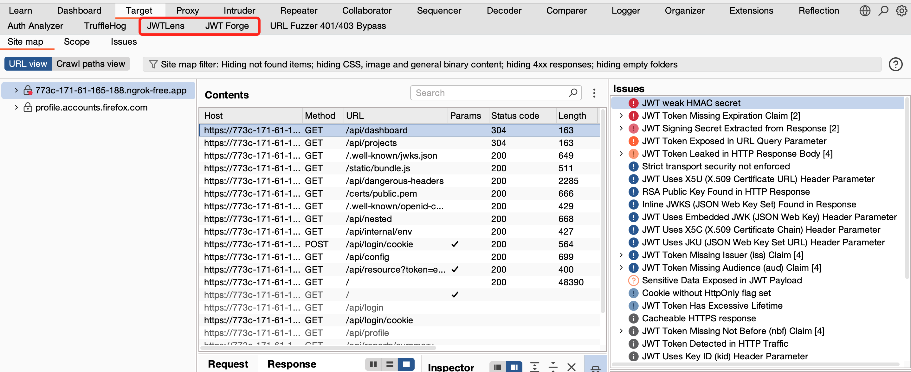
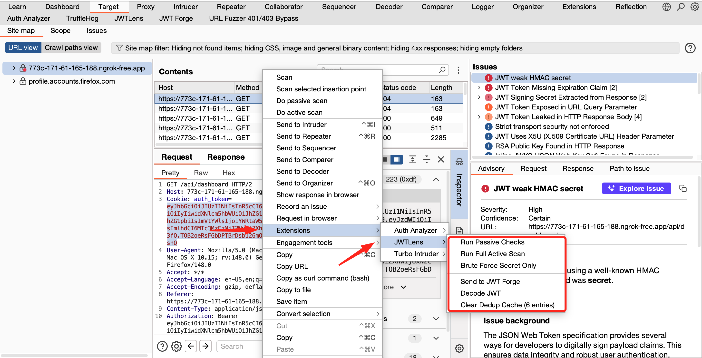
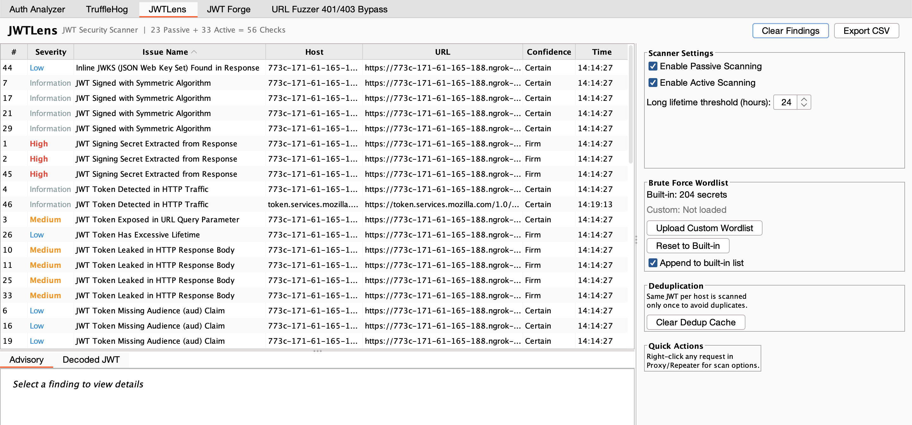
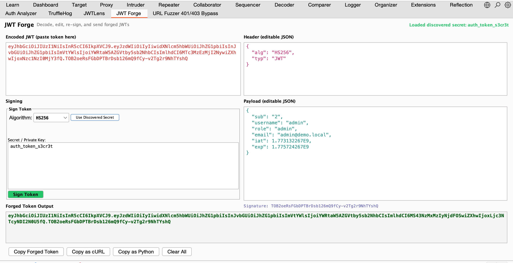

# JWTLens

**Comprehensive JWT Security Scanner for Burp Suite**

JWTLens is a Burp Suite extension that automatically detects and tests JSON Web Tokens (JWTs) for security vulnerabilities. It performs **56 security checks** covering the complete JWT attack surface — from passive analysis of token configuration to active exploitation of signature bypasses, algorithm confusion, header injection, and more.

JWTLens is a JWT decoder and security testing tool for analyzing JSON Web Tokens.
It helps detect vulnerabilities like algorithm confusion, signature bypass, and weak validation.


JWTLens adds two dedicated tabs in Burp Suite's top bar: **JWTLens** (findings dashboard) and **JWT Forge** (live token editor and signer). It also passively extracts secrets and keys from JavaScript files and API responses to supercharge its active attacks.



## Why JWTLens?

Most JWT testing tools either require manual effort or only cover a handful of checks. JWTLens runs automatically in the background as you browse, catching JWT misconfigurations the moment they appear in your proxy traffic. When you want to go deeper, the active scanner tests every known JWT attack vector against the server with a single right click.

Compared to existing JWT extensions, JWTLens adds:

- Full passive scanning (no other extension does this)
- **JWT Forge tab** — a live jwt.io-style editor with signing built into Burp
- **Secret Extractor** — passively finds hardcoded secrets and keys in JS/JSON/HTML responses
- **Proper JWKS parsing** — fetches the real server public key for algorithm confusion attacks
- **Request + Response scanning** — brute force and all actions work on JWTs found anywhere, not just in requests
- Weak secret brute forcing with custom wordlist support (augmented by extracted secrets)
- KID injection testing (SQL injection, command injection, LDAP injection, path traversal with 10+ paths)
- x5u and x5c header injection
- Claim tampering for privilege escalation
- Smart deduplication to avoid duplicate findings
- A built-in findings dashboard with CSV export

## Key Features

### JWT Forge Tab

A dedicated Burp tab that works like jwt.io but with real attack capabilities:

- **Paste any JWT** — instantly decodes into editable header and payload JSON with syntax coloring
- **Algorithm selector** — switch between none, HS256, HS384, HS512, RS256, RS384, RS512
- **Sign Token** — re-sign the edited token with your chosen algorithm and secret/key
- **Use Discovered Secret** — one-click auto-fill with secrets found by brute force or the Secret Extractor
- **Copy as cURL** — generates a ready-to-paste `curl` command with the forged token as a Bearer header
- **Copy as Python** — generates a Python `requests` script with the forged token
- **Send to Forge** — right-click any request in Proxy/Repeater and send its JWT directly to the Forge tab
- When brute force cracks a secret, the token and secret are **automatically loaded** into Forge for immediate re-signing

### Secret Extractor (Passive)

Runs automatically on every JS, JSON, HTML, and text response flowing through Burp Proxy:

- **Hardcoded JWT secrets** — detects assignments like `JWT_SECRET = "..."`, `"jwtSecret": "..."`, `JWT_SECRET=value` across JS, JSON, .env, and YAML patterns
- **RSA/EC private keys** — detects PEM-formatted private keys exposed in responses
- **RSA public keys** — extracts and stores for use in algorithm confusion attacks
- **Inline JWKS** — detects `{"keys":[...]}` structures embedded in responses
- **JWKS URL references** — finds `jwks_uri`, `jwks_url`, and similar references for the active scanner to follow
- **Base64-encoded secrets** — decodes `atob("...")` and `Buffer.from("...")` patterns
- **False positive filtering** — ignores template variables (`${...}`), common placeholder values, and generic words
- Discovered secrets are **automatically prepended** to the brute force wordlist (tested first, highest priority)
- Discovered public keys are **automatically fed** into the algorithm confusion attack (A07)
- All discoveries are **reported as findings** in the JWTLens tab with severity ratings

### Proper JWKS Parsing for Algorithm Confusion (A07)

The algorithm confusion attack (RS256 to HS256) now uses the **server's actual public key** instead of a generated one:

- **Phase 1** — Fetches JWKS from well-known endpoints (`/.well-known/jwks.json`, `/jwks.json`, etc.)
- **Phase 2** — Follows `jwks_uri` from OpenID Configuration if direct JWKS is not found
- **Phase 3** — Uses public keys discovered by the Secret Extractor from JS/response bodies
- **Phase 4** — Tests each real key in both DER and PEM encoding as the HMAC secret
- **Phase 5** — Falls back to a generated key pair only if no real key is available
- **Smart key selection** — matches by the token's `kid`, then by `use=sig`, then by `alg=RS*`
- Proper JWK parsing reconstructs `RSAPublicKey` objects from `n` and `e` Base64url values
- This means the attack **actually works against real targets** where it previously would always fail

### Request + Response JWT Extraction

All context menu actions now search **both the request and response** for JWTs:

- **Brute Force** — finds and cracks JWTs from response bodies (e.g., login endpoints, config APIs)
- **Send to Forge** — works with JWTs from any location
- **Decode JWT** — decodes all JWTs found in both request and response, labeled with their source
- **Multi-JWT picker** — when multiple JWTs are found (e.g., one in request header, one in response body), a dialog lets you choose which one to act on
- Each JWT is labeled `[Request]` or `[Response]` so you always know where it came from

## What JWTLens Covers — 56 Security Checks

### Passive Checks (23 checks, no requests sent)

These run automatically on every request and response flowing through Burp Proxy.

**Token Detection and Leakage**

- **P01** — JWT detected in HTTP traffic *(Info)*
- **P02** — JWT exposed in URL query parameter *(Medium)*
- **P03** — JWT exposed in URL fragment *(Medium)*
- **P14** — JWT leaked in HTTP response body *(Medium)*

**Cookie Security**

- **P04** — JWT cookie missing HttpOnly flag *(Medium)*
- **P05** — JWT cookie missing Secure flag *(Medium)*
- **P06** — JWT cookie missing SameSite attribute *(Low)*

**Token Lifetime**

- **P07** — JWT missing expiration (exp) claim *(High)*
- **P08** — JWT has excessive lifetime (configurable threshold) *(Low)*
- **P10** — Expired JWT still being sent in requests *(Info)*

**Claim Validation**

- **P11** — Missing issuer (iss) claim *(Low)*
- **P12** — Missing audience (aud) claim *(Low)*
- **P22** — Missing not before (nbf) claim *(Info)*
- **P23** — Missing unique identifier (jti) claim *(Info)*

**Sensitive Data and Structure**

- **P09** — Sensitive data in JWT payload (emails, passwords, SSN, credit cards, API keys) *(Medium)*
- **P13** — Symmetric algorithm detected (brute force advisory) *(Info)*
- **P20** — Nested JWT detected inside payload *(Info)*

**Dangerous Header Parameters**

- **P15** — kid (Key ID) parameter present *(Info)*
- **P16** — jku (JWKS URL) parameter present *(Low)*
- **P17** — x5u (X.509 Certificate URL) parameter present *(Low)*
- **P18** — x5c (X.509 Certificate Chain) parameter present *(Low)*
- **P19** — jwk (Embedded JSON Web Key) parameter present *(Low)*
- **P21** — Weak or deprecated signing algorithm *(Medium)*

**Secret Extraction (Passive)**

- **S01** — JWT signing secret extracted from JS/JSON/HTML response *(High)*
- **S02** — RSA/EC private key exposed in HTTP response *(High)*
- **S03** — RSA public key found in HTTP response *(Low)*
- **S04** — Inline JWKS found in response *(Low)*
- **S05** — JWKS URL reference discovered in response *(Info)*
- **S06** — Base64-encoded secret decoded from response *(High)*

### Active Checks (33 checks, sends modified requests)

These run during active scanning or when triggered manually through the right-click menu.

**Signature Bypass**

- **A01** — Algorithm None attack (all 16 case permutations of "none") *(High)*
- **A02** — Invalid signature accepted (signature verification not enforced) *(High)*
- **A03** — Signature stripping (empty signature accepted) *(High)*
- **A23** — Null signature bytes accepted *(High)*
- **A28** — Payload modification accepted without re-signing *(High)*

**Weak Keys**

- **A05** — Empty secret key accepted (HMAC with empty password) *(High)*
- **A06** — Weak secret brute force (200+ built-in + extracted secrets, custom wordlist support) *(High)*
- **A26** — Weak RSA key size detected (modulus under 2048 bits) *(High)*

**Algorithm Attacks**

- **A07** — Algorithm confusion RS256 to HS256 (proper JWKS parsing, uses server's real public key) *(High)*
- **A22** — Cross algorithm signing (HS384, HS512 with empty or known key) *(High)*
- **A25** — Algorithm confusion with forged public key (Sign2n) *(High)*

**Header Injection**

- **A08** — JWK header injection (self-signed key embedded in token) *(High)*
- **A09** — JKU header injection (attacker-controlled JWKS URL) *(High)*
- **A10** — JKU SSRF pingback (server makes outbound request to attacker URL) *(Medium)*
- **A11** — X5U header injection (attacker-controlled certificate URL) *(High)*
- **A12** — X5C header injection (self-signed certificate embedded in token) *(High)*

**KID Injection**

- **A13** — KID path traversal (10+ traversal paths including /dev/null, /etc/hostname) *(High)*
- **A14** — KID SQL injection (UNION SELECT, OR bypass, error-based) *(High)*
- **A15** — KID command injection (time-based detection with sleep payloads) *(High)*
- **A16** — KID LDAP injection (wildcard and filter manipulation) *(High)*

**Token Lifetime and Claims**

- **A04** — Expired JWT accepted by server *(High)*
- **A17** — Not before (nbf) claim not enforced *(Medium)*
- **A18** — Claim tampering for privilege escalation (admin, role, sub manipulation) *(High)*
- **A19** — Subject claim enumeration (user ID discovery) *(Medium)*
- **A24** — Token accepted beyond reasonable clock skew tolerance *(Medium)*

**CVEs and Cryptographic Issues**

- **A20** — CVE-2022-21449 Psychic Signatures (Java ECDSA zero value bypass) *(High)*
- **A21** — ECDSA signature malleability *(Low)*

**Reconnaissance and Logic**

- **A27** — JWKS endpoint discovery (well-known paths) *(Info)*
- **A29** — typ header manipulation accepted *(Low)*
- **A30** — Token confusion between endpoints (cross-service replay) *(Medium)*
- **A31** — Token still valid after logout *(Medium)*
- **A32** — Token still valid after password change *(Medium)*
- **A33** — JWKS spoofing via well-known path override *(High)*

### Coverage Summary

- **Passive checks:** 23 + 6 Secret Extraction checks
- **Active checks:** 33
- **Total:** 62
- **High severity:** 31
- **Medium severity:** 14
- **Low severity:** 10
- **Info:** 7

## Installation

### Prerequisites

You need Java 17 or later and Burp Suite Professional or Community Edition (2024.1 or later with Montoya API support).

### Building from Source

```
git clone https://github.com/chawdamrunal/JWTLens.git
cd JWTLens/jwtlens-burp
./gradlew clean jar
```

The built JAR file will be at `build/libs/jwtlens-1.0.0.jar`.

### Installing in Burp Suite

1. Open Burp Suite
2. Go to Extensions > Installed > Add
3. Set Extension Type to Java
4. Click Select File and choose `jwtlens-1.0.0.jar`
5. Click Next

JWTLens will appear as two new tabs in Burp's top tab bar. You will also see a confirmation message in the extension output:

```
=========================================
  JWTLens v1.0.0 Loaded Successfully
  JWT Security Scanner for Burp Suite
  23 Passive + 33 Active = 56 Checks
  + JWT Forge Tab + Secret Extractor
=========================================
```

## Usage

### Automatic Scanning

Once installed, JWTLens works automatically:

- **Passive scanning** runs on every request and response that flows through Burp Proxy. Any time a JWT is detected, JWTLens analyzes it for misconfigurations, missing claims, sensitive data, cookie security issues, and more. No action needed from you.
- **Secret Extractor** runs alongside passive scanning on every JS, JSON, and HTML response. Discovered secrets are immediately available to active scans and the Forge tab.
- **Active scanning** runs when you use Burp's built-in active scanner. JWTLens registers custom insertion points for JWT tokens and tests all active attack vectors automatically.

### Manual Scanning



Right-click any request in Proxy, Repeater, Intruder, or Logger and select from the JWTLens menu:

- **Run Passive Checks** — analyzes the JWT without sending any requests
- **Run Full Active Scan** — sends modified JWT tokens to test all attack vectors
- **Brute Force Secret Only** — tests the JWT against 200+ common secrets (plus any extracted secrets) offline and shows a popup if the secret is found. Works on JWTs in both requests and responses.
- **Send to JWT Forge** — sends the JWT to the Forge tab for manual editing and re-signing
- **Decode JWT** — prints the decoded header, payload, and signature to the extension output

All actions search both the request and response for JWTs. If multiple JWTs are found, a picker dialog lets you choose which one to act on.

### JWTLens Tab



The JWTLens tab in Burp's top bar gives you a centralized dashboard:

- **Findings Table** — all JWT findings with sortable columns for severity, issue name, host, URL, confidence, and timestamp. Severity is color-coded (red for High, orange for Medium, blue for Low, gray for Info).
- **Advisory Panel** — full issue detail and remediation guidance when you select a finding. Same content as Burp's Issues tab but in a dedicated view.
- **Decoded JWT Panel** — decoded header, payload, and signature for the JWT associated with the selected finding.
- **Scanner Settings** — enable or disable passive and active scanning, configure the long lifetime threshold (default 24 hours).
- **Brute Force Wordlist** — upload a custom wordlist file (.txt or .lst, one secret per line). Append to the built-in list or use as a replacement. Click Reset to Built-in to go back to defaults.
- **Deduplication** — shows the number of unique JWTs tracked with a button to clear the cache. JWTLens deduplicates by host and JWT signature so the same token across multiple endpoints only gets scanned once.
- **Export CSV** — saves all findings to a CSV file for reporting.

### JWT Forge Tab



The JWT Forge tab provides a complete token editing and signing workspace:

- **Encoded JWT** (left) — paste any JWT to decode it, or view the forged output
- **Header JSON** (right top) — editable JSON with syntax coloring, changes reflected in real time
- **Payload JSON** (right middle) — editable claims, modify roles, expiry, subject, or any claim
- **Signing panel** (left middle) — select algorithm, enter secret/key, click Sign Token
- **Forged Token Output** (bottom) — the re-signed JWT ready to copy
- **Action buttons** — Copy Forged Token, Copy as cURL, Copy as Python, Clear All

The Forge tab integrates with the rest of JWTLens:

- Brute force cracks a secret → token + secret auto-loaded into Forge
- Secret Extractor finds a key in JS → available via "Use Discovered Secret" button
- Right-click "Send to JWT Forge" → token loaded for editing

## Smart Deduplication

One of the most common complaints about JWT scanners is duplicate findings for the same token on every request. JWTLens tracks each unique JWT per host and only scans it once. If you browse 50 pages on the same site and every request has the same JWT, you get one set of findings, not 50.

The dedup cache can be cleared at any time from the JWTLens tab or the right-click context menu.

## Custom Wordlists

JWTLens ships with a built-in wordlist of 200+ commonly used JWT secrets including jwt.io defaults, common passwords, framework defaults, and patterns found in real-world leaks. The Secret Extractor automatically augments this list with any secrets discovered in JavaScript or API responses during the session.

To use your own wordlist:

1. Go to the JWTLens tab
2. In the Brute Force Wordlist section, click Upload Custom Wordlist
3. Select a text file with one secret per line (lines starting with # are ignored)
4. Choose whether to append to the built-in list or replace it

For maximum coverage, use a larger wordlist. The jwt-secrets project on GitHub maintains a comprehensive list, or you can use any password wordlist. JWTLens performs offline verification first (fast, no network traffic) and only sends requests to the server when a match is found.

## How It Compares

**Existing JWT Extensions:**

- No passive scanning
- ~16 active checks
- Duplicate findings on every request
- No weak secret brute force
- No KID SQL/command/LDAP injection
- No x5u/x5c header injection
- No claim tampering
- No cookie security checks
- No dedicated UI tab, no CSV export, no custom wordlist
- No JWT editor with signing
- No secret extraction from JS
- Algorithm confusion uses generated keys (never works on real targets)
- Brute force only works on request JWTs

**JWTLens:**

- 23 passive checks + 6 secret extraction checks running automatically
- 33 active checks
- 62 total checks
- Smart host + JWT deduplication
- 200+ built-in secrets + extracted secrets + custom wordlist support
- KID SQL injection (UNION SELECT, error-based), command injection (time-based), LDAP injection
- Full x5u and x5c header injection support
- Role, admin, sub claim manipulation
- HttpOnly, Secure, SameSite cookie checks
- Full dashboard with findings, decoded JWT, config
- One-click CSV export
- Upload and manage custom wordlists from UI
- JWT Forge tab with live editing, signing, cURL/Python export
- Passive secret extraction from JS, JSON, HTML responses
- Proper JWKS parsing with real server key for algorithm confusion
- Brute force and all actions work on JWTs in both requests and responses
- Multi-JWT picker when multiple tokens are found

## Testing JWTLens

To see JWTLens in action with maximum findings, test it against intentionally vulnerable applications:

- **PortSwigger JWT Labs** — https://portswigger.net/web-security/jwt has 8 free labs covering unverified signatures, algorithm none, weak keys, JWK injection, JKU injection, KID path traversal, and algorithm confusion. No setup required, just proxy through Burp.
- **Broken Crystals** — https://github.com/NeuraLegion/brokencrystals covers the widest range of JWT vulnerabilities including KID SQL injection, weak secret, algorithm confusion, x5u, x5c, JWK, and JKU attacks. Run it locally with docker-compose.
- **WebGoat** — https://hub.docker.com/r/webgoat/webgoat has a dedicated JWT section with 4 challenges. Run it with `docker run -p 8080:8080 webgoat/webgoat`.
- **OWASP Juice Shop** — https://hub.docker.com/r/bkimminich/juice-shop uses JWT with a weak secret and has multiple JWT-related challenges.

## Project Structure

```
jwtlens-burp/
  build.gradle                    Build configuration
  settings.gradle                 Project settings
  src/main/java/com/jwtlens/
    JwtLensExtension.java         Extension entry point, registers everything
    JwtLensTab.java               Main Burp tab with findings dashboard and config
    JwtForgeTab.java              JWT Forge tab — live editor, signer, PoC exporter
    SecretExtractor.java          Passive secret/key extraction from JS and responses
    JwksParser.java               JWKS JSON parser for real public key extraction
    JwtToken.java                 JWT parsing, decoding, encoding, and mutation
    CryptoUtils.java              HMAC, RSA, ECDSA signing and key generation
    JwtDedup.java                 Smart deduplication tracker
    ResponseAnalyzer.java         Response comparison for accepted vs rejected
    WeakSecrets.java              Built-in wordlist of 200+ common secrets
    Findings.java                 All issue definitions with descriptions
    PassiveScanCheck.java         23 passive checks
    ActiveScanCheck.java          33 active checks with proper JWKS-based A07
    JwtInsertionPointProvider.java  Custom insertion points for JWT tokens
    JwtContextMenu.java           Right-click context menu (request + response aware)
```

## License

MIT License

## Credits

Built by the JWTLens team. Inspired by the JWT security research community and the OWASP Testing Guide.

## Developed by Mrunal Chawda
